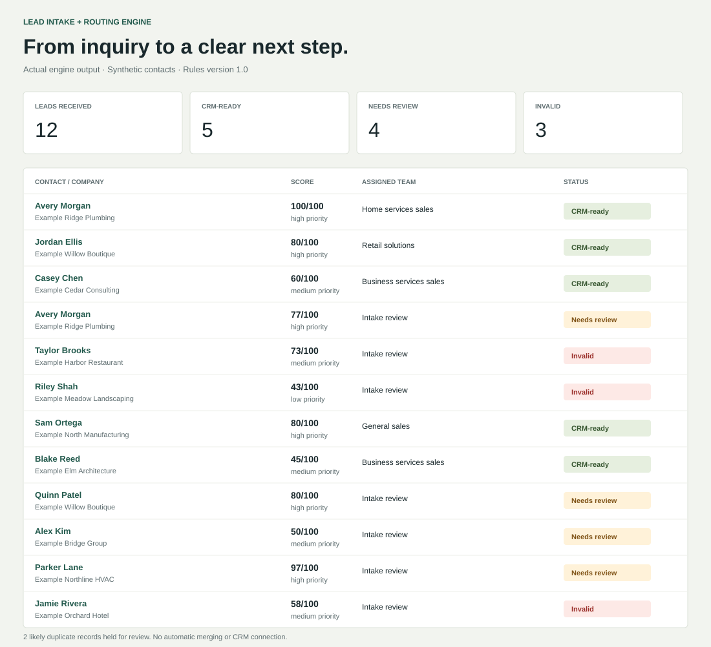
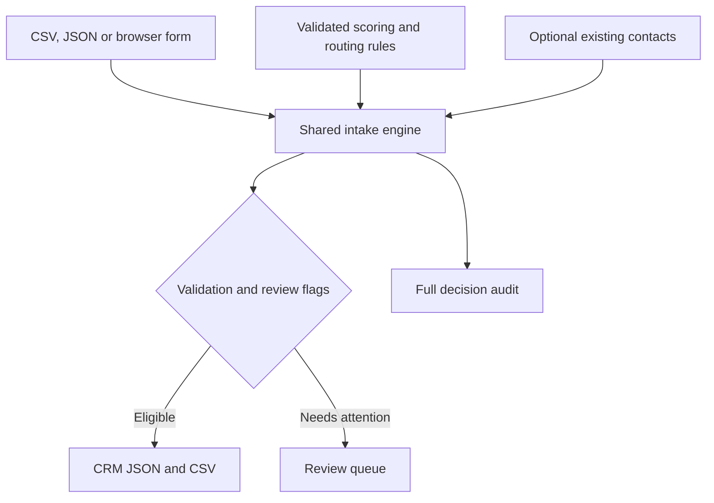

# Lead Intake + Routing Engine

**Turn a spreadsheet of inquiries into a clean, prioritized, assigned lead queue.**

A functional local business tool with a browser form, CSV/JSON imports, configurable scoring, duplicate review, and CRM-ready exports. Built for small and midsize businesses that need a consistent handoff between incoming inquiries and sales follow-up.

No paid services, API keys, external AI calls, or runtime dependencies. All included contacts and companies are fictional.



## The business problem

Leads arrive from forms, referrals, events, and spreadsheets. Names and phone formats vary. Repeat inquiries become duplicate contacts. Missing information reaches the CRM. Sales teams disagree about which opportunities to work first and who owns them.

This engine creates a repeatable intake policy: validate each record, normalize its fields, identify likely duplicates, explain its priority, assign a team, and separate eligible contacts from records requiring review.

## Run the demonstration

Install **Node.js 22 or newer**. From the project folder:

```bash
npm ci --ignore-scripts
npm start
```

Open **http://127.0.0.1:4173** and select **Load sample leads**. Select a contact to inspect its score, routing explanation, and flags. Import your own synthetic CSV/JSON or submit the form, edit the rules, and download the outputs.

The browser processes imported data in memory. The local server only serves application files; it has no upload endpoint. Refreshing the page clears imported leads and rule edits. Download results and rules before closing it.

For a file-based workflow:

```bash
npm run demo
node src/cli.js --input samples/form-lead.json --out output
node src/cli.js --input samples/leads.csv --existing samples/existing-contacts.csv --out output
node src/cli.js --input samples/leads.csv --rules config/rules.json --out output --strict
```

`--strict` still writes the exports and returns exit code **2** if any record needs review or is invalid. Normal success returns **0**; file, format, configuration, or invocation errors return **1**. Input paths are relative to your current working directory. The default rules path is resolved relative to the application.

## What it does

| Step | Behavior |
| --- | --- |
| Validate | Reject malformed files; flag invalid contact information, amounts, and urgency. |
| Normalize | Trim and collapse whitespace, lowercase emails, normalize phone formats, parse USD estimates. Preserve name capitalization. |
| Detect duplicates | Match valid email, phone plus extension, or full name plus company against earlier rows and an optional existing contact list. |
| Categorize | Match configured keywords in company and service interest; use a general fallback and review tied matches. |
| Tag | Preserve ordinary source tags and add category, priority, source, high-value, and data-quality tags. |
| Score | Apply documented business rules and retain the points and reasons for every component. |
| Assign | Route eligible leads to a configured team. Route invalid and review records to Intake review. |
| Summarize | Generate a concise description of interest, estimate, urgency, priority, team, and status. |
| Export | Produce vendor-neutral JSON/CSV for eligible leads and a separate review queue. |

**Gender is never inferred.** Gender and spouse/partner fields are preserved only when supplied and never influence categorization, scoring, or assignment. Notes and custom info fields also do not influence scoring or classification.

## See the result

The default 12-record [sample CSV](samples/leads.csv) produces:

| Outcome | Count | Example |
| --- | ---: | --- |
| CRM-ready | 5 | Avery Morgan: 100/100, Home services sales |
| Needs review | 4 | Duplicate Avery inquiry, shared company phone, category tie, unverified link |
| Invalid | 3 | Malformed phone, no contact method, malformed USD estimate |
| Likely duplicates | 2 | Included within review; no automatic merging |

Inspect the actual generated [full audit JSON](docs/example-output/processed-leads.json), [CRM JSON](docs/example-output/crm-ready.json), [CRM CSV](docs/example-output/crm-ready.csv), and [review CSV](docs/example-output/review-queue.csv). The image above is a generated view of these results, not a browser screenshot or a client case study.

```json
{
  "lead_id": "lead-0001",
  "first_name": "Avery",
  "last_name": "Morgan",
  "company": "Example Ridge Plumbing",
  "email": "avery.morgan@example.com",
  "phone": "+13125550101",
  "category": "home_services",
  "lead_score": 100,
  "priority": "high",
  "assignment": "Home services sales",
  "status": "ready_for_crm"
}
```

This excerpt omits other retained fields. The full JSON includes input fields, tags, summary, rules version, score breakdown, flags, and duplicate match reasons.

## Inputs

CSV requires a header row. JSON accepts one lead object or an array of lead objects. Human-readable headers such as `First Name`, `Service Interest`, and `Info Field 1` map to their snake_case equivalents. `spouse` and `partner` map to `spouse_partner`; `source` maps to `lead_source`. Conflicting aliases fail rather than silently overwrite values.

| Fields | Input behavior |
| --- | --- |
| `first_name`, `last_name`, `title`, `company` | Text; incomplete names/company receive warnings. |
| `gender`, `spouse_partner` | Optional source-provided text, with no inference or ranking use. |
| `email`, `phone` | At least one syntactically valid contact method required. A supplied invalid method blocks export even when the other is valid. |
| `location`, `lead_source`, `service_interest` | Text; missing values receive warnings. |
| `estimated_value` | Nonnegative USD number/text, such as `12000` or `$12,000.00`; missing is unknown, not zero. |
| `urgency` | `high`, `medium`, `low`, or blank. |
| `notes` | Text; leading formula characters and HTTP links trigger review. |
| `info_field_1` through `info_field_4` | Optional text for client-specific intake details. |
| `tags` | Semicolon/comma-separated text or a JSON array of strings. Engine-managed tags are recalculated. |

Score, assignment, category, status, and summary are calculated outputs. Unknown input fields are ignored with warnings. Arrays/objects are rejected in scalar fields. Limits: **2 MB per input file**, **2,000 leads per batch**, **2,000 existing contacts**, **4,000 characters per field**. A structural input error aborts the batch without producing new results.

## Transparent scoring and routing

Edit [config/rules.json](config/rules.json) or use the browser's rule editor. Configuration is validated before processing.

| Component | Default points |
| --- | --- |
| Valid email | 8 |
| Valid phone | 7 |
| Company supplied | 5 |
| Urgency | High 25; medium 15; low 5; missing 0 |
| Estimated value | USD 10,000+ → 25; 5,000+ → 18; 1,000+ → 10; below 1,000 or missing → 0 |
| Category fit | 20 for a configured category; general/ambiguous → 0 |
| Source | Referral 10; website 7; event 5; CSV import 3; other/unknown 0 |

Default maximum: **100**. Custom rules may total more; the reported score is capped at 100 and the raw total remains in the audit. High priority begins at **75**; medium at **45**. Priority expresses the configured policy, not a probability of closing or independently verified lead quality. A high score never overrides review or validation requirements.

Eligible home services, retail, professional services, and hospitality leads route to their corresponding teams. Unmatched eligible leads route to **General sales**. Category keyword ties, duplicate candidates, suspicious text, and unverified links require review. Validation errors produce `invalid`; otherwise review flags produce `needs_review`; warnings alone permit `ready_for_crm`.

## Architecture



The browser and command line call the same pure processing module. There is no database, remote CRM connection, email sending, or hidden model call. Deterministic sample data yields repeatable output.

| Path | Purpose |
| --- | --- |
| [src/engine.js](src/engine.js) | Validation, normalization, duplicate indexes, classification, scoring, assignment |
| [src/csv.js](src/csv.js) | Strict CSV parsing and spreadsheet-safe export |
| [src/cli.js](src/cli.js) | File intake and four output files |
| [src/server.js](src/server.js) | Localhost-only static server with an explicit file allowlist |
| [public/](public/) | Browser form, import queue, rule editor, detail view, downloads |
| [test/](test/) | Engine, CSV, CLI, and HTTP contract tests |
| [docs/data-contract.md](docs/data-contract.md) | Field semantics, review rules, and export details |
| [docs/commercial-use.md](docs/commercial-use.md) | Client adaptation scope and acceptance criteria |

## Validation

```bash
npm test
npm run audit
```

Tests cover malformed CSV/JSON-shaped input, normalization, no demographic inference, score explanations, configurable rules, duplicate detection, review exclusion, formula-safe exports, actual CLI output, and the local server's file/host/method boundary. The live HTTP smoke test skips only when the environment denies local listening sockets; the handler contract is still tested. Browser interactions require a separate manual check; the automated suite does not simulate clicks.

The [GitHub Actions workflow](.github/workflows/validate.yml) runs tests and the public-file audit on Node 22 and 24. It uses pinned action revisions and read-only repository permissions. The audit checks likely secrets, prohibited files, local documentation paths, sample-only data, parseable source files, dependency metadata, and whether example exports still match the sample engine output. It is a focused publication check, not a guarantee against every credential format or vulnerability.

Regenerate the examples and result graphic after changing rules or sample data:

```bash
npm run examples
node scripts/render-example.js
npm run audit
```

## Commercial use case

The sellable capability is **a consistent lead intake and sales handoff process**. Adapt the client's form and spreadsheet fields, define qualified lead criteria with the owner, configure team routing, and map the approved export to their CRM. The client can see why each contact is prioritized and which records require attention before import.

This repository demonstrates that workflow with synthetic cases. It does not claim a real client deployment, measured time savings, increased sales, or native compatibility with a specific CRM. The [commercial adaptation guide](docs/commercial-use.md) defines a concrete delivery scope and acceptance checks.

## Limitations and handling real data

- Email/phone checks validate syntax; they do not verify deliverability, ownership, existence, or permission to contact someone. Ten-digit numbers default to the US; other countries require an explicit `+` code. Phone extensions remain separate.
- Duplicate matching is conservative and order-dependent: candidates reference the first earlier matching row. Shared company numbers can match different people. No automatic merging, fuzzy identity resolution, or cross-session storage occurs. Supply existing contacts for another batch.
- Batch IDs are positional, not permanent CRM identifiers. For live imports, map teams to CRM owner IDs and implement persistent IDs/upsert logic outside this engine.
- USD only. Estimated values are intake estimates, not financial forecasts. Rules are simple keyword/business heuristics; misclassification is possible.
- CRM CSV uses JSON arrays in the tags cell. Spreadsheet-safe cells beginning with `=`, `+`, `-`, or `@` receive an apostrophe prefix, including international phone numbers. Use CRM JSON or a reviewed mapping adapter when the target importer requires raw phone text or a different tag delimiter.
- This is a local tool, not an authenticated public intake service. Production hosting requires appropriate access controls, storage/retention design, monitoring, abuse controls, and a reviewed CRM adapter.
- Keep real lead lists and exports outside this public repository. `data/`, `uploads/`, and `output/` are ignored as a convenience; ignore rules do not prevent all accidental disclosure. Exports can include optional personal details and notes: minimize those fields for a live CRM handoff.

## License

[MIT](LICENSE). Commercial adaptation is permitted under the license terms.
